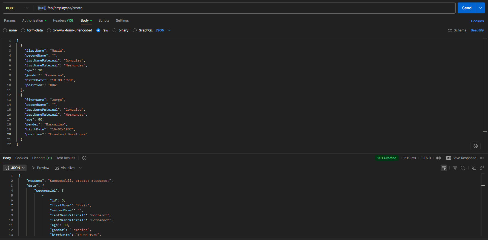
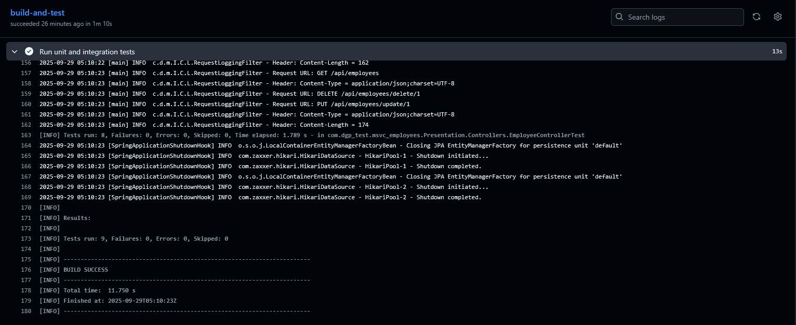

# Evidence of Functionality

**Project:** MSVC Employees  
**Author:** David Garcia Prado

This document provides visual evidence that the microservice is working correctly, including endpoints, unit tests, and CI/CD pipeline execution.

---

## Table of Contents

1. [Swagger UI Endpoints](#swagger-ui-endpoints)
2. [API Requests](#api-requests)
    - [Get All Employees](#get-all-employees)
    - [Get Employee by ID](#get-employee-by-id)
    - [Create Employee](#create-employee)
    - [Update Employee](#update-employee)
    - [Delete Employee](#delete-employee)
    - [Search Employees](#search-employees)
3. [Unit Tests](#unit-tests)
4. [GitHub Actions Pipeline](#github-actions-pipeline)
5. [Database Evidence (Optional)](#database-evidence-optional)

---

## Swagger UI Endpoints

Swagger UI showing all available endpoints.

---

## API Requests

### User Login

POST request to authenticate a user and receive a JWT token.

### Get All Employees

GET request to retrieve all employees.

### Get Employee by ID

GET request to retrieve a single employee by ID.

### Create Employee

POST request to create one or multiple employees.

### Update Employee

PUT request to update an employee by ID.

### Delete Employee

DELETE request to remove an employee by ID.

### Search Employees

GET request to search employees by name.

---

## Unit Tests

Evidence of unit tests execution using JUnit and Mockito, all passing successfully.

---

## GitHub Actions Pipeline

Execution of the CI/CD pipeline in GitHub Actions, showing build, test, and deployment steps.

---

> All images should be placed in the `docs/screenshots/` folder and referenced here.  
> Use descriptive file names for clarity and easy navigation.
